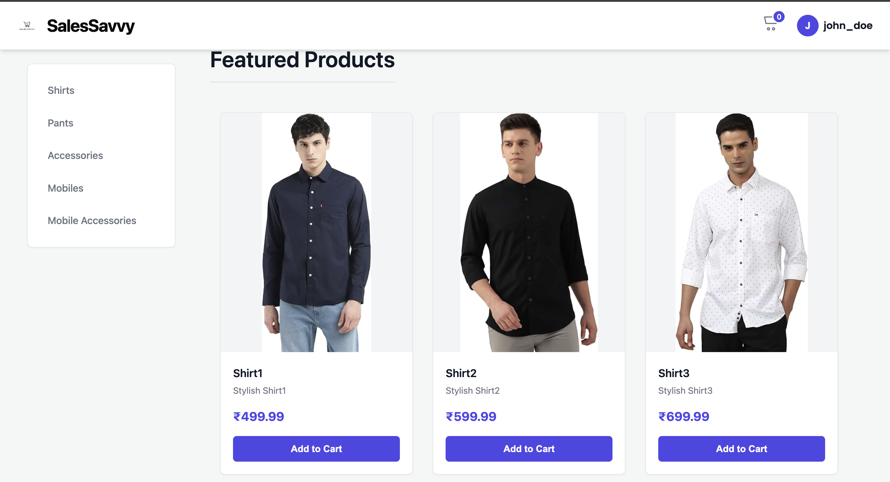
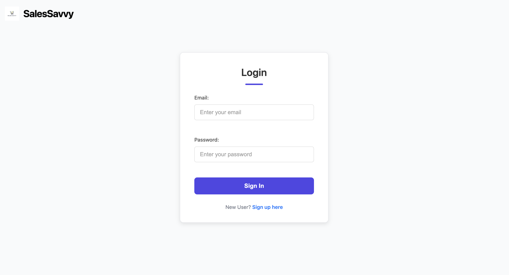
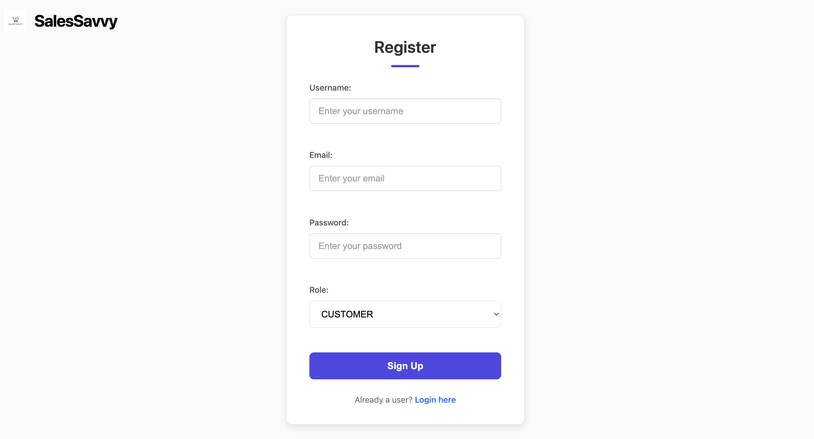
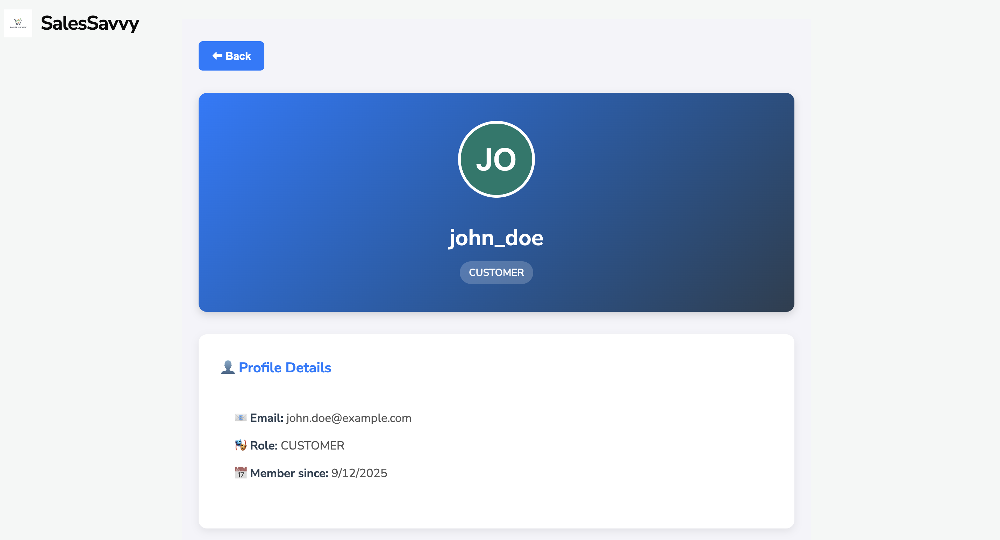
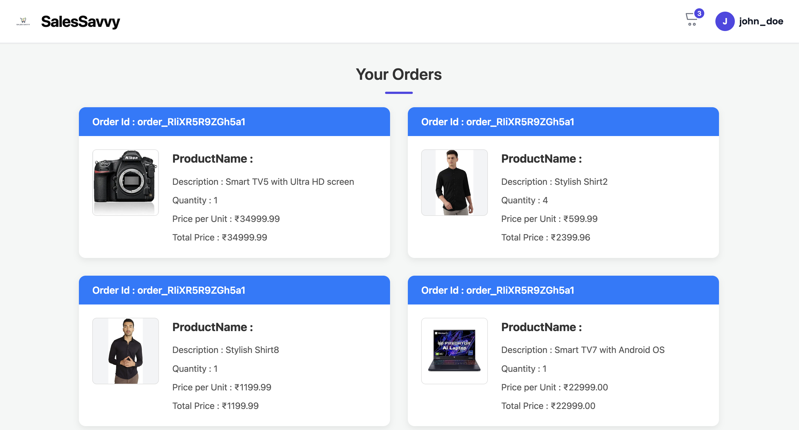
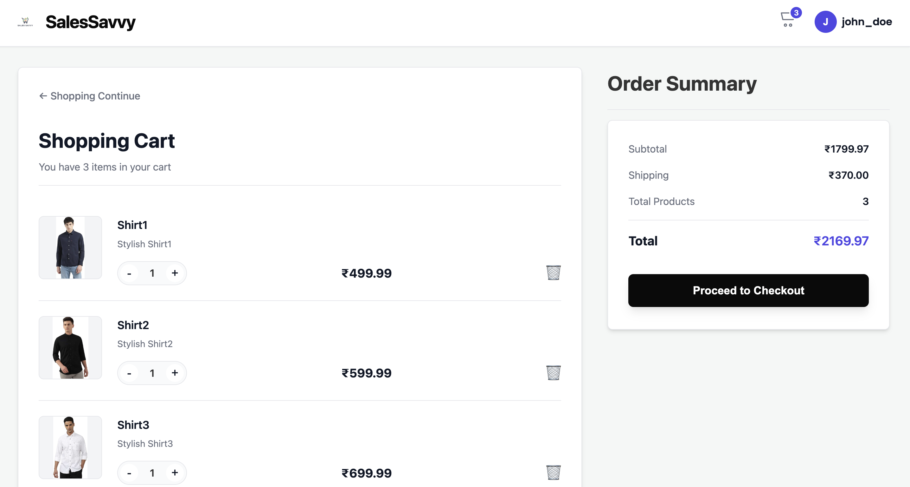
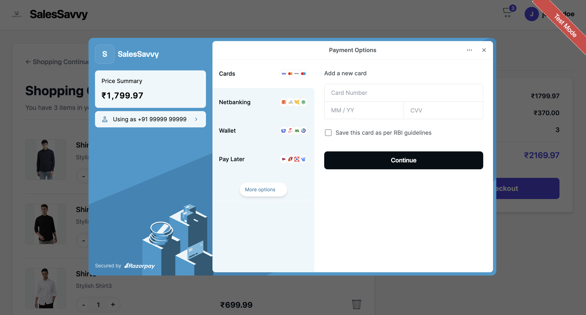
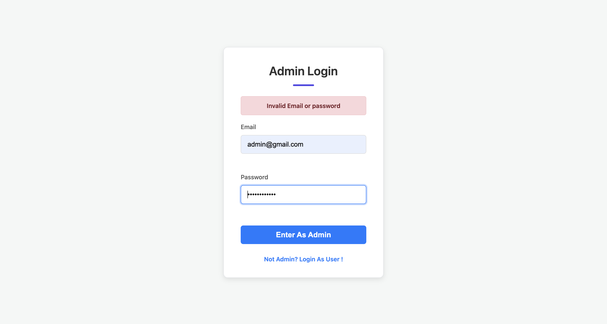

# SalesSavvy Frontend

The **SalesSavvy Frontend** is the user-facing interface of the e-commerce application. It is built with **React.js** and styled using **custom CSS**, without external UI libraries. This frontend communicates with the backend via secure APIs, handles JWT authentication through cookies, and provides both **customer** and **admin** experiences.

---

## 🚀 Features

### 👤 Customer Features

* **User Authentication** (Registration & Login via JWT stored in cookies).
* **Browse Products** by categories.
* **Cart Management** (add, update, remove items).
* **Checkout with Razorpay** (test mode integration).
* **Profile Management** (update user info, view past orders).

📸 Screenshots:

* 
* 
* 
* 
* 
* 
* 

---

### 🛠️ Admin Features

* **Admin Authentication** (login via JWT).
* **Dashboard** with daily, monthly, yearly, and overall sales reports.
* **Manage Products** (add, update, delete).
* **Manage Users** (view, update customer info).

📸 Screenshots:

* 
* 

---

## 🔐 Authentication Flow

* On login, the backend generates a **JWT token**.
* Token is sent to frontend and stored in **browser cookies**.
* Every request from frontend uses `credentials: "include"` so cookies go automatically.
* A backend **JWT filter** validates the token and forwards the request.

---

## 💳 Payment Flow (Razorpay)

1. User clicks **Place Order** on checkout.
2. Frontend sends cart details to backend → backend creates Razorpay order.
3. Razorpay checkout popup opens.
4. On success, backend verifies signature & confirms order.

📸 Screenshot:

* 

---

## 📂 Project Structure

```
Ecommerce/
├── src/
│   ├── components/
│   │   ├── CustomerHome.jsx
│   │   ├── ProductList.jsx
│   │   ├── CartPage.jsx
│   │   ├── OrderPage.jsx
│   │   ├── ProfileInfo.jsx
│   │   ├── AdminDashboard.jsx
│   │   ├── AdminLogin.jsx
│   │   └── ...
│   ├── assets/
│   └── App.jsx
├── docs/   # screenshots for README
│   ├── Home.png
│   ├── Login.png
│   ├── Registration.png
│   ├── Profile.png
│   ├── Orders.png
│   ├── Checkout.png
│   ├── Payment.png
│   ├── Adminlogin.png
│   └── Admin Dashboard.png
├── Dockerfile
├── nginx.conf
├── package.json
└── README.md
```

---

## 🐳 Dockerization

The frontend is containerized with Docker and served using **Nginx**.

### Build & Run

```bash
docker build -t salessavvy-frontend .
docker run -p 3000:80 salessavvy-frontend
```

---

## 🛠️ Tech Stack

* **React.js** (Frontend Framework)
* **CSS** (Custom Styling)
* **Razorpay** (Payment Gateway)
* **Docker + Nginx** (Deployment)

---

## 📜 License

This project is licensed under the **MIT License**.
